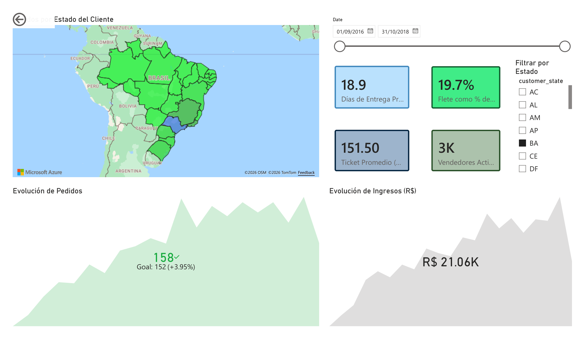
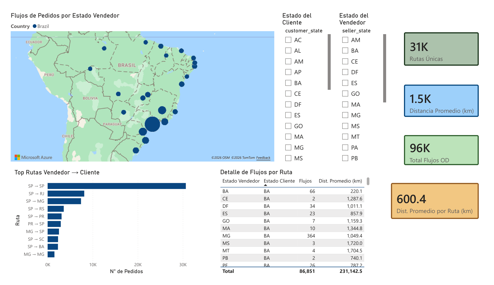
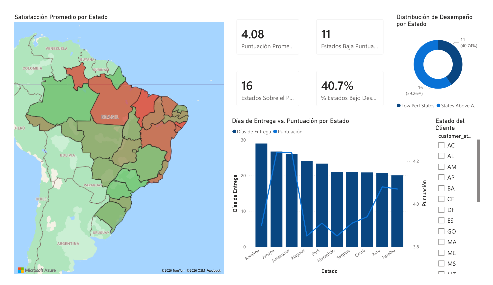

# Análisis Geoespacial del E-Commerce Brasileño (Olist)

Estadística espacial avanzada sobre 100 000 órdenes de e-commerce brasileño (2016–2018): clustering DBSCAN de vendedores, regresión geográficamente ponderada (GWR) sobre tiempos de entrega y autocorrelación espacial de satisfacción (Moran's I / LISA), integrado en un dashboard Power BI.

---

## Objetivo

Responder tres preguntas sobre la dimensión espacial del e-commerce en Brasil, dimensión que los KPIs agregados ocultan:

1. ¿Dónde se concentran los vendedores y qué regiones del país están desatendidas?
2. ¿Cómo varía *localmente* el efecto de la distancia sobre los días de entrega según la región?
3. ¿La baja satisfacción de los compradores está espacialmente correlacionada, o es aleatoria?

---

## Problema / Contexto

Brasil es un país continental: un vendedor en São Paulo y un comprador en Manaus pueden compartir exactamente la misma categoría de producto y, sin embargo, experimentar tiempos de entrega, costos de flete y puntajes de satisfacción radicalmente distintos. Los KPIs agregados estándar oscurecen por completo esta señal espacial.

El dataset público de Olist (Kaggle) ofrece 100 000 órdenes reales con coordenadas ZIP de vendedores y compradores, lo que permite aplicar técnicas de geoestadística que van más allá del análisis tabular convencional.

---

## Datos

| Característica | Detalle |
|---|---|
| **Fuente** | [Olist Brazilian E-Commerce Public Dataset](https://www.kaggle.com/datasets/olistbr/brazilian-ecommerce) — Kaggle |
| **Volumen** | ~100 000 órdenes · 8 tablas relacionales CSV · 2016–2018 |
| **Tablas principales** | `orders`, `order_items`, `customers`, `sellers`, `products`, `order_reviews`, `order_payments`, `geolocation` |
| **Geometría** | Centroides de ZIP codes (latitud/longitud) derivados de la tabla `geolocation` |
| **Cobertura** | Todo Brasil; 27 estados |

---

## Herramientas y tecnologías

| Categoría | Tecnología |
|---|---|
| Ingestión de datos | `kagglehub`, `pandas` |
| Geoespacial | `geopandas` 1.0+, `shapely` |
| Estadística espacial | `esda`, `libpysal`, `pysal` (Moran's I, LISA) |
| Machine learning | `scikit-learn` (DBSCAN), `mgwr` (GWR) |
| Visualización | `folium` (mapas interactivos), `matplotlib`, `seaborn` |
| Dashboard | Power BI Desktop (Azure Maps, DAX, esquema estrella) |
| Entorno | Conda (`olist-geo`) |

---

## Metodología

```
Kaggle API          →   01_eda.ipynb         →   02_data_quality.ipynb
(kagglehub)             (perfil 8 tablas)        (limpieza, ZIP centroides)
                                             ↓
                    03_predictive_models.ipynb   →   04_powerbi_prep.ipynb
                    (DBSCAN · GWR · Moran/LISA)      (4 CSVs para dashboard)
                                             ↓
                    outputs/maps/            →   powerbi/version_avanzada.pbix
                    (3 HTML Folium)              (3 páginas, Azure Maps, DAX)
```

1. **EDA** — Perfil de las 8 tablas: distribuciones, timeline de órdenes, conteos de nulos.
2. **Calidad geoespacial** — Detección de coordenadas fuera de los límites de Brasil; derivación de centroides de ZIP a partir de medias de latitud/longitud en la tabla `geolocation`.
3. **Clustering DBSCAN** — `eps=50 km`, `min_samples=3` sobre coordenadas de vendedores. Identificación de clusters densos y zonas desatendidas.
4. **GWR (Regresión Geográficamente Ponderada)** — Distancia Haversine vendedor-comprador como predictor del tiempo de entrega; coeficientes locales para revelar cuellos de botella regionales.
5. **Moran's I / LISA** — Índice de autocorrelación espacial de la satisfacción promedio por estado; mapa de cuadrantes (HH/LL/HL/LH).
6. **Dashboard Power BI** — Exportación de 4 CSVs analíticos; esquema estrella con `DimSellerState`; medidas DAX para KPIs y flujos OD; Azure Maps para visualización geográfica.

---

## Mi rol y contribución

Desarrollé el proyecto de principio a fin de manera individual:

- **Diseñé las tres preguntas de investigación** y seleccioné las técnicas estadístico-espaciales apropiadas para cada una (DBSCAN para clustering, GWR para heterogeneidad espacial, Moran's I/LISA para autocorrelación).
- **Construí los cuatro módulos reutilizables** (`data_loader.py`, `quality_checks.py`, `geospatial_utils.py`, `models.py`) que separan la lógica de transformación y modelado del análisis en los notebooks.
- **Resolví el problema de filtrado de Azure Maps en Power BI:** el mapa de burbujas mostraba el total global en lugar de los valores por estado porque usaba un campo de la tabla de hechos como Location. Lo solucioné creando una tabla dimensión `DimSellerState` calculada con DAX y configurando la relación bidireccional con `od_flows`, lo que propagó correctamente el contexto de filtro.
- **Diseñé el esquema estrella** del dashboard y escribí las medidas DAX para los KPIs principales y las métricas de flujo OD.
- **Generé los tres mapas interactivos Folium** con codificación visual diferenciada por técnica: burbujas por cluster (DBSCAN), coropleta de coeficientes locales (GWR) y cuadrantes LISA por color.

---

## Resultados e insights clave

| Análisis | Hallazgo |
|---|---|
| **DBSCAN** | Concentración máxima en el corredor Sudeste (SP–MG–PR); el 71% de los flujos OD provienen de São Paulo |
| **GWR** | El efecto de la distancia sobre los días de entrega varía significativamente por región; cuellos de botella marcados en Norte y Nordeste |
| **Moran's I** | Se confirma autocorrelación espacial positiva en los puntajes de satisfacción; los estados de baja satisfacción se agrupan geográficamente |
| **Flujos OD** | 68 079 flujos originados en São Paulo · distancia media de ~1 500 km (escala continental) |

### Mapas interactivos

Los tres mapas se generan al ejecutar `notebooks/03_predictive_models.ipynb` y se guardan en `outputs/maps/`:

| Mapa | Descripción |
|---|---|
| `seller_clusters.html` | Mapa de burbujas: clusters DBSCAN de vendedores por centroide ZIP |
| `gwr_coefficients.html` | Coropleta: coeficiente GWR local (efecto de distancia sobre entrega) por ubicación |
| `lisa_satisfaction.html` | Mapa LISA: cuadrantes HH/LL/HL/LH de satisfacción por estado |

### Dashboard Power BI

Archivo: `powerbi/version_avanzada.pbix`

| Página | Contenido |
|---|---|
| **Geospatial Overview** | KPI cards (órdenes, ticket promedio, entrega, reseña) + barras por estado + slicers fecha/categoría |
| **OD Flow Analysis** | Azure Maps (flujos por estado vendedor) + Top 10 rutas OD + slicers de estado |
| **Satisfaction** | KPIs de satisfacción + entrega vs. satisfacción + indicador de estados de bajo desempeño |

### Pantallazos del Dashboard







---

## Cómo ejecutar

```bash
# 1. Crear entorno conda
conda env create -f environment.yml
conda activate olist-geo

# 2. Registrar kernel
python -m ipykernel install --user --name olist-geo --display-name "olist-geo"

# 3. Ejecutar notebooks en orden
jupyter notebook notebooks/01_eda.ipynb
# → luego 02_data_quality → 03_predictive_models → 04_powerbi_prep
```

Los datos se descargan automáticamente vía `kagglehub` en la primera ejecución (requiere cuenta Kaggle configurada localmente).
